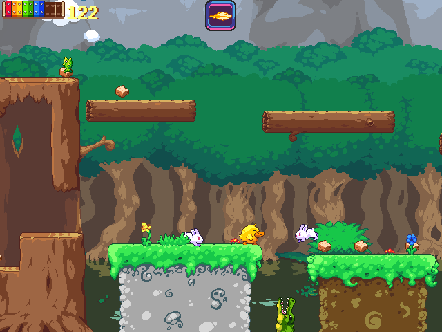
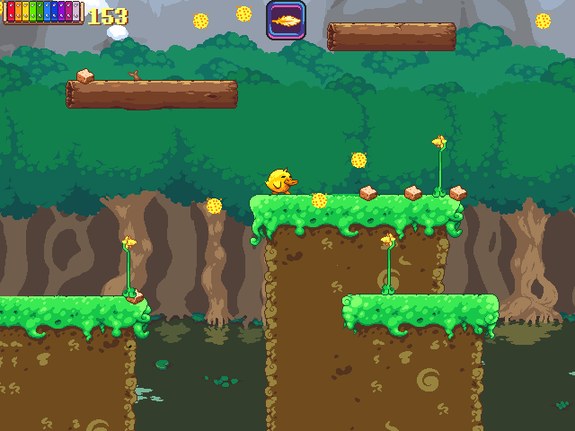

# Project 1 Proposal

## 1. Game Concept

This game, Duck and the Land of Flightless Birds Web Version, is a port of a 2D Platformer I've been working on for a while, I hope to recreate the first few levels in the game.

## 2. Genre

This game is an action-adventure platformer with metriodvania elements. Focus on action and swapping weapons.

## 3. Platform

This will be availible for both desktop and mobile platforms, with a version of the game's controls for mobile appearing on those devices.

## 4. Story

The "story" is that a hunter has stolen these eggs from your village, so you have to go out and get them back. 

## 5. Visuals and Sound

The visuals are all pixel based. The music is more of a classical based sound, mostly some nice jams for the game, get the player excited and ethusiastic about playing. 

## 6. Gameplay

There's a few movement quirks, along with your standard jump/ move you also have a flutter ability by default and a few more moves as the game progresses. Usually you'd only have one weapon, but for the sake of keeping the levels limited, the player has three weapons unlocked by default. 

## 7. Screenshots

## 8. Developer

My name's Kent, I'm a second year GDD major with a background in Web Development and Software Engineering. I started programming when I was 12 when I learned binary, I soon picked up C++ and haven't stopped making neat programs since.